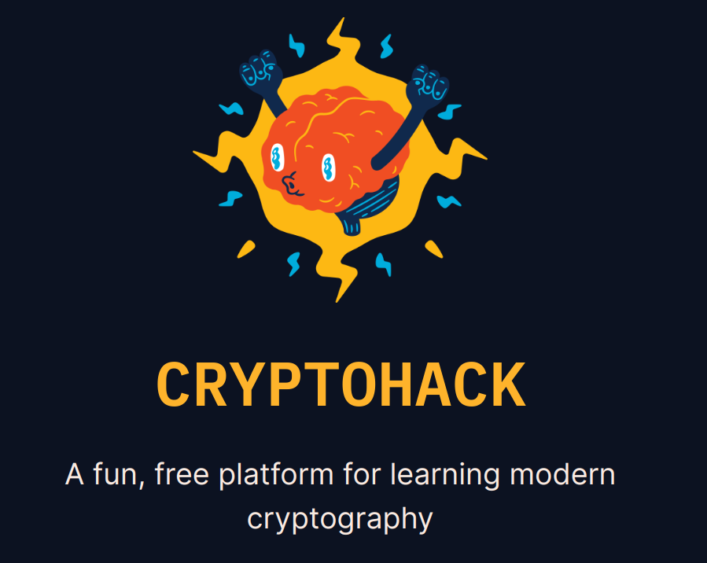

## I Learned more about modern cryptography by solving a series of interactive puzzles and challenges with CRYTOHACK.

This repo contained solutions to challenges I attempted.

- [Great SNAKES](great_snakes.py)
- [ASCII](ascii.py)
- [HEX](hex.py)
- [BASE 64](base64.py)

If you are interested in cryptography, check out [crytohack](https://cryptohack.org/)